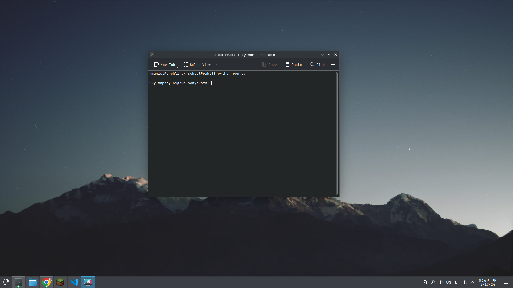
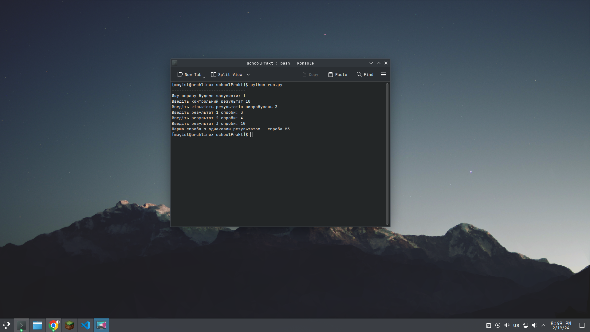
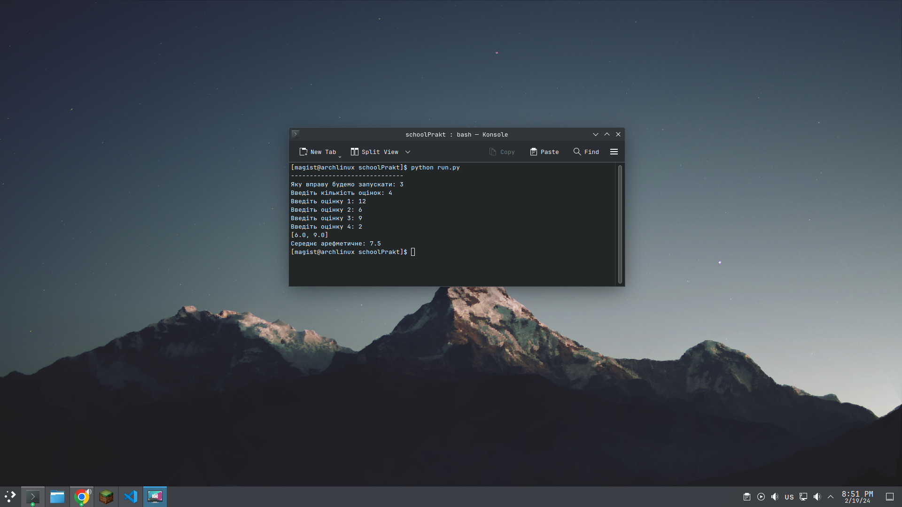

<h1>Практична по інформатиці</h1>
<h3>Тема: Алгоритми опроцювання масивів</h3>

<h2>Фото вправ<h2> 

Програма запуску

Перша вправа

Друга вправа

Остання вправа

by. Magist <b>(Artem Cherevko)</b>